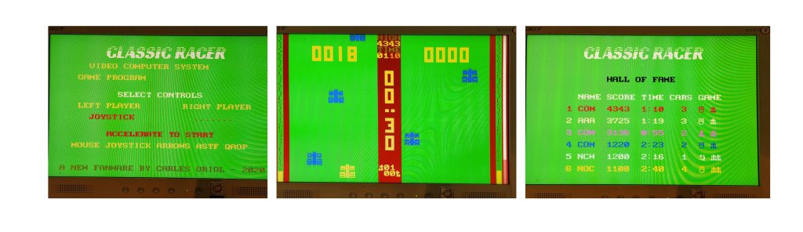

# FabGL ClassicRacer
8 bits classic racer for FabGL

A neo retro game, recreating the smell, look and feel of my children games.
Reference game Soundic Programmable Car Race GP https://www.youtube.com/watch?v=zVEe7g6gyFM

Thanks to www.FabGL.com - 2019 by Fabrizio Di Vittorio for this amazing library. This guy is really amazing, I've enjoyed a lot just watching the samples of his libraries it's so GREAT!!

Thanks to Shenzhen Xin Yuan Electronics for creating the funny TTGO VGA32 http://www.lilygo.cn/.

I't has been great playing with it.

Thanks to my Nurieta for being everything else in my life.

Since 22/8/2020

Version 0.9

https://github.com/carlesoriol/classicracer

Carles Oriol - Barcelona 2020
carlesoriol@gmail.com

## About the game

I know I'm a speccy person. But It was too strong the temptation to do it on 320x200 with 8 sprites like a Mocodore 64. :-DDD

I've also simulated the 64 SID sound with ADSR wave definitions.

Maybe I will create some fun version for spectrum (or spectrum next), mocodore or for super-modern super-computers like the raspberry with raylib.

## Game controls

Move left or right on the home screen to select the controls

- Mouse - Easiest to win
- Keyboard
- Keys: QAOP - So speccy
- Cursor keys
- Keys: ASTF
- Joystick. (I use a classic Atari 2600 joystick connected at pins: JOY_LEFT 13, JOY_RIGHT 2, JOY_DOWN 14, JOY_FIRE 12)

Play with friends or family is always more funny. Create your competitions.

## Game score

To win you have to advance 200 cars before your adversary

Each car will give you more or less score depending on your speed

If you arrive to the finish line without crashing a sweet bonus is waiting for you.

## Hall of fame

Only game winners enter the hall of fame.

If you have an excellent score but you don't win. HOF is not for you :-D

Scores are stored in spiffs

## License
[AGPL](https://choosealicense.com/licenses/agpl/)
